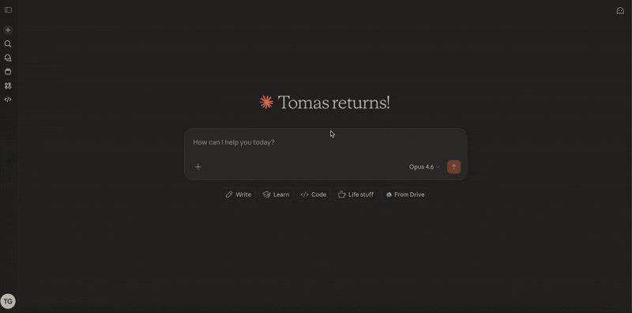

# @postergully/lolly-mcp

This package is a cloned-and-owned fork of [`freema/openclaw-mcp`](https://github.com/freema/openclaw-mcp) (imported at upstream SHA `6a2aa7d3cac8bfea17756a0b4cbc517fe1046a7a`). Upstream infrastructure — gateway client, OAuth, async task store, instance routing — is kept unchanged. The generic tool surface (`openclaw_chat`, `openclaw_chat_async`, `openclaw_status`, `openclaw_instances`, `openclaw_task_*`) has been replaced with three semantic tools scoped to Lolly: `lolly_query`, `lolly_report`, `lolly_task_status`. (`lolly_executeSuiteQL` exists internally for unit tests but is intentionally not exposed on the public MCP surface — see M4.1 carry-forward.)

See the design spec at [`docs/LOLLY-AS-PLUGIN-DESIGN.md`](../../nanoclaw/docs/LOLLY-AS-PLUGIN-DESIGN.md) and the envelope reference in this repo under `docs/ENVELOPE.md` (written in M2).

## Local stdio mode (M1+)

Used by cowork's stdio connector config. Bridge spawned as a child process, MCP over stdin/stdout. No network, no auth.

```bash
# Build once
cd bridge && pnpm install && pnpm run build

# Inside .mcp.json (plugin side) — invokes the Keychain-sourced wrapper
{
  "command": "lolly-mcp-launch",
  "args": ["node", "/Applications/nanoclaw/lolly-claude-plugin/bridge/dist/index.js"]
}
```

`lolly-mcp-launch` (operator's host-side script, not in this repo) reads `lolly-gateway-token` from macOS Keychain and injects as `LOLLY_GATEWAY_TOKEN` env. Never appears in `ps` args or scrollback.

## Remote mode — HTTPS + OAuth (M4)

Used when enrolling as a Claude cowork **custom connector**. Bridge runs as a long-lived HTTP server; cowork connects over HTTPS; every call is authenticated with OAuth 2.1 bearer tokens.

### Transport

**Streamable HTTP on `/mcp`** — the only load-bearing endpoint. Token-by-token streaming works via the Streamable HTTP `text/event-stream` upgrade path inside `/mcp`; no separate SSE endpoint needed. Legacy `/sse` + `/messages` were deleted in M4 Task 3 to shrink the attack surface.

- `POST /mcp` — JSON-RPC request/response
- `GET /mcp` — server-initiated event stream (notifications)
- `DELETE /mcp` — explicit session termination
- Session identity via `Mcp-Session-Id` header

### Preflight

1. **Gateway up**: `curl -sSf http://127.0.0.1:18789/health` must return `{"ok":true,"status":"live"}`. If not, restart via the Container-A procedure in `/Applications/nanoclaw/CLAUDE.md` — never `kubectl exec`.

2. **`LOLLY_GATEWAY_TOKEN` fresh** — re-read from `openclaw dashboard --no-open` URL fragment and probe:

   ```bash
   curl -sS -o /dev/null -w "%{http_code}\n" \
     -H "Authorization: Bearer $LOLLY_GATEWAY_TOKEN" \
     http://127.0.0.1:18789/v1/models
   ```

   Must return `200`. A `401` here means the gateway token drifted on the bridge side — NOT a NetSuite credential problem. See the §1 Boundaries rule 5 in the design doc for why these are distinct hops.

3. **OAuth creds in Keychain** (one-time provisioning, never echo the generated values):

   ```bash
   security add-generic-password -a "$USER" -s lolly-mcp-oauth-id -U \
     -w "$(openssl rand -hex 16)"
   security add-generic-password -a "$USER" -s lolly-mcp-oauth-secret -U \
     -w "$(openssl rand -hex 32)"
   ```

4. **ngrok tunnel** pointing `https://revenue-frostlike-surely.ngrok-free.dev` at `http://127.0.0.1:3000`.

### Launch

```bash
lolly-mcp-launch --remote
```

Does:
- Reads `lolly-gateway-token`, `lolly-mcp-oauth-id`, `lolly-mcp-oauth-secret` from Keychain.
- Sets `MCP_ISSUER_URL=https://revenue-frostlike-surely.ngrok-free.dev` (override via env for a different public URL).
- Sets `ACCESS_LOG_PATH=/tmp/lolly-mcp-access.log`.
- Execs the bridge in `--transport http --port 3000 --issuer-url …` mode.
- Auth auto-enables because `--transport http + --issuer-url` signals remote deployment.

### Connector URL (for cowork)

```
https://revenue-frostlike-surely.ngrok-free.dev/mcp
```

Enter as-is in cowork settings → Custom connectors → Add new. Paste OAuth client_id + secret from Keychain (never echo). Cowork redirects to `/authorize` → approve → returns to settings "Connected".

### Access log

One JSONL line per `/mcp` request at `ACCESS_LOG_PATH`. Shape only — never `data.rows`, `data.narrative`, `intent_restated`, `assumptions`, `error.message`, `confidence_reason`. Example:

```json
{"ts":"2026-05-12T11:05:40Z","method":"POST","path":"/mcp","status":200,"duration_ms":103,"tool":"lolly_query","envelope_status":"refused","envelope_confidence":"high","lolly_session_id":"—"}
```

Tail with `tail -f /tmp/lolly-mcp-access.log | jq .`.

### Troubleshooting

| Symptom | Diagnosis | Fix |
|---|---|---|
| `401` from `/mcp` with valid cowork bearer | OAuth session expired (default 1h TTL) | Disconnect + reconnect connector in cowork settings |
| `401` from `/authorize` | Unknown `client_id` | Re-provision Keychain entries, re-paste into cowork |
| `400 Unregistered redirect_uri` at authorize | Cowork's callback URL isn't in `MCP_REDIRECT_URIS` | Observe the `redirect_uri` query param in the failing authorize URL, add to `MCP_REDIRECT_URIS`, restart |
| Fast `401` from bridge → gateway (4-7ms) | Stale `LOLLY_GATEWAY_TOKEN` | Re-read from `openclaw dashboard --no-open`, re-run the Keychain store, restart bridge. **NOT a NetSuite problem.** |
| `ERR_EMPTY_RESPONSE` at dashboard | Gateway crashed or wrong container | Container-A restart procedure (see `/Applications/nanoclaw/CLAUDE.md`) |

---

(Original upstream README follows.)

<!-- mcp-name: io.github.freema/openclaw-mcp -->

# OpenClaw MCP Server

[](https://www.npmjs.com/package/openclaw-mcp)
[](https://github.com/freema/openclaw-mcp/actions/workflows/ci.yml)
[](https://opensource.org/licenses/MIT)
[](https://github.com/freema/openclaw-mcp/pkgs/container/openclaw-mcp)
[](https://openclaw-mcp.cloud)

<a href="https://glama.ai/mcp/servers/@freema/openclaw-mcp">
  
</a>

🦞 Model Context Protocol (MCP) server for [OpenClaw](https://github.com/openclaw/openclaw) AI assistant integration.

## Demo

<p align="center">
  
</p>

## Why I Built This

Hey! I created this MCP server because I didn't want to rely solely on messaging channels to communicate with OpenClaw. What really excites me is the ability to connect OpenClaw to the Claude web UI. Essentially, my chat can delegate tasks to my Claw bot, which then handles everything else — like spinning up Claude Code to fix issues for me.

Think of it as an AI assistant orchestrating another AI assistant. Pretty cool, right?

## Quick Start

### Docker (Recommended)

Pre-built images are published to GitHub Container Registry on every release.

```bash
docker pull ghcr.io/freema/openclaw-mcp:latest
```

Create a `docker-compose.yml`:

```yaml
services:
  mcp-bridge:
    image: ghcr.io/freema/openclaw-mcp:latest
    container_name: openclaw-mcp
    restart: unless-stopped
    ports:
      - "3000:3000"
    environment:
      - OPENCLAW_URL=http://host.docker.internal:18789
      - OPENCLAW_GATEWAY_TOKEN=${OPENCLAW_GATEWAY_TOKEN}
      - OPENCLAW_MODEL=openclaw
      - AUTH_ENABLED=true
      - MCP_CLIENT_ID=openclaw
      - MCP_CLIENT_SECRET=${MCP_CLIENT_SECRET}
      - MCP_ISSUER_URL=${MCP_ISSUER_URL:-}
      - CORS_ORIGINS=https://claude.ai
    extra_hosts:
      - "host.docker.internal:host-gateway"
    read_only: true
    security_opt:
      - no-new-privileges
```

Generate secrets and start:

```bash
export MCP_CLIENT_SECRET=$(openssl rand -hex 32)
export OPENCLAW_GATEWAY_TOKEN=your-gateway-token
docker compose up -d
```

Then in Claude.ai add a custom MCP connector pointing to your server with `MCP_CLIENT_ID=openclaw` and your `MCP_CLIENT_SECRET`.

> **Tip:** Pin a specific version instead of `latest` for production: `ghcr.io/freema/openclaw-mcp:1.1.0`

### Local (Claude Desktop)

```bash
npx openclaw-mcp
```

Add to your Claude Desktop config:

```json
{
  "mcpServers": {
    "openclaw": {
      "command": "npx",
      "args": ["openclaw-mcp"],
      "env": {
        "OPENCLAW_URL": "http://127.0.0.1:18789",
        "OPENCLAW_GATEWAY_TOKEN": "your-gateway-token",
        "OPENCLAW_MODEL": "openclaw",
        "OPENCLAW_TIMEOUT_MS": "300000"
      }
    }
  }
}
```

### Remote (Claude.ai) without Docker

```bash
AUTH_ENABLED=true MCP_CLIENT_ID=openclaw MCP_CLIENT_SECRET=your-secret \
  MCP_ISSUER_URL=https://mcp.your-domain.com \
  CORS_ORIGINS=https://claude.ai OPENCLAW_GATEWAY_TOKEN=your-gateway-token \
  npx openclaw-mcp --transport sse --port 3000
```

> **Important:** When running behind a reverse proxy (Caddy, nginx, etc.), you **must** set `MCP_ISSUER_URL` (or `--issuer-url`) to your public HTTPS URL. Without this, OAuth metadata will advertise `http://localhost:3000` and clients will fail to authenticate.

See [Installation Guide](docs/installation.md) for details.

## Architecture

```
┌─────────────────────────────────────────────────────────────────┐
│                         Your Server                             │
│                                                                 │
│  ┌─────────────────┐      ┌─────────────────────────┐          │
│  │   OpenClaw      │      │    OpenClaw MCP         │          │
│  │   Gateway       │◄────►│    Bridge Server        │          │
│  │   :18789        │      │    :3000                │          │
│  │                 │      │                         │          │
│  │  OpenAI-compat  │      │  - OAuth 2.1 auth       │          │
│  │  /v1/chat/...   │      │  - CORS protection      │          │
│  └─────────────────┘      │  - Input validation     │          │
│                           └──────────┬──────────────┘          │
│                                      │                          │
└──────────────────────────────────────┼──────────────────────────┘
                                       │ HTTPS + OAuth 2.1
                                       ▼
                              ┌─────────────────┐
                              │   Claude.ai     │
                              │   (MCP Client)  │
                              └─────────────────┘
```

## Available Tools

### Sync Tools

| Tool | Description |
|------|-------------|
| `openclaw_chat` | Send messages to OpenClaw and get responses |
| `openclaw_status` | Check OpenClaw gateway health |
| `openclaw_instances` | List all configured OpenClaw instances |

### Async Tools (for long-running operations)

| Tool | Description |
|------|-------------|
| `openclaw_chat_async` | Queue a message, get task_id immediately |
| `openclaw_task_status` | Check task progress and get results |
| `openclaw_task_list` | List all tasks with filtering |
| `openclaw_task_cancel` | Cancel a pending task |

## Prompts

The bridge exposes two MCP prompts via `prompts/list` + `prompts/get` so any harness connecting to it gets a baseline for tool usage and envelope judging — no plugin install required.

| Prompt | Description |
|--------|-------------|
| `lolly_usage` | How to decide when to call Lolly and which `lolly_*` tool to pick. Load on connect. |
| `lolly_judging` | How to read a Lolly envelope and decide trust / retry / surface. Load after every tool call. |

Prompt bodies are generated at build time from `plugin/skills/<name>/SKILL.md` (single source of truth). Plugin users (Claude Code with the companion plugin installed) get the richer skill-file version with frontmatter, activation hints, and reference links. Every other harness — Claude Desktop with a manual `.mcp.json`, Cursor, raw MCP clients — gets the compact prompt body via the MCP prompts capability.

To inspect:

```text
# MCP prompts/list
> { "method": "prompts/list" }
< { "prompts": [ {"name": "lolly_usage", ...}, {"name": "lolly_judging", ...} ] }

# MCP prompts/get
> { "method": "prompts/get", "params": { "name": "lolly_usage" } }
< { "description": "...", "messages": [ { "role": "user", "content": { "type": "text", "text": "<skill body>" } } ] }
```

## Multi-Instance Mode

Orchestrate multiple OpenClaw gateways from a single MCP server. One bridge, many claws — route requests to prod, staging, dev, or whatever you name them (lobster-supreme and the-claw-abides are perfectly valid names).

```
┌──────────────────────────────────────────────────────────────────────┐
│                        Claude.ai / Claude Desktop                    │
│                              (MCP Client)                            │
└──────────────────────┬───────────────────────────────────────────────┘
                       │
                       ▼
┌──────────────────────────────────────────────────────────────────────┐
│                     OpenClaw MCP Bridge Server                        │
│                                                                      │
│  ┌──────────────┐  ┌──────────────┐  ┌──────────────┐               │
│  │  Instance     │  │  Instance     │  │  Instance     │              │
│  │  Registry     │  │  Resolver     │  │  Validator    │              │
│  └──────┬───────┘  └──────┬───────┘  └──────┬───────┘               │
│         │                 │                  │                        │
│  ┌──────┴─────────────────┴──────────────────┴───────┐               │
│  │              Per-Instance OpenClaw Clients          │              │
│  │     (separate auth, timeout, URL per instance)     │              │
│  └────────┬──────────────┬──────────────┬────────────┘               │
└───────────┼──────────────┼──────────────┼────────────────────────────┘
            │              │              │
            ▼              ▼              ▼
   ┌──────────────┐ ┌──────────────┐ ┌──────────────┐
   │  🦞 prod     │ │  🦞 staging  │ │  🦞 dev      │
   │  (default)   │ │              │ │              │
   │  :18789      │ │  :18789      │ │  :18789      │
   │  OpenClaw GW │ │  OpenClaw GW │ │  OpenClaw GW │
   └──────────────┘ └──────────────┘ └──────────────┘
```

### Setup

```bash
OPENCLAW_INSTANCES='[
  {"name": "prod", "url": "http://prod:18789", "token": "tok1", "default": true},
  {"name": "staging", "url": "http://staging:18789", "token": "tok2"},
  {"name": "dev", "url": "http://dev:18789", "token": "tok3"}
]'
```

### Usage

All tools accept an optional `instance` parameter to target a specific gateway:

```
# Chat with staging instance
openclaw_chat message="Deploy status?" instance="staging"

# Check health of prod
openclaw_status instance="prod"

# List all configured instances
openclaw_instances

# Async task targeting dev
openclaw_chat_async message="Run tests" instance="dev"
```

When `instance` is omitted, the default instance is used. Each instance has its own auth token, timeout, and URL — fully isolated.

### Key Features

- **Zero-migration upgrade** — existing single-instance deployments work without any config change
- **Per-instance isolation** — separate auth tokens, timeouts, and URLs
- **Dynamic routing** — Claude picks the right instance per request
- **Task tracking** — async tasks remember which instance they target
- **Security** — tokens are never exposed via `openclaw_instances`

See [Configuration — Multi-Instance Mode](docs/configuration.md#multi-instance-mode) for the full reference.

## Documentation

- [Installation](docs/installation.md) — Setup for Claude Desktop & Claude.ai
- [Configuration](docs/configuration.md) — Environment variables & options
- [Deployment](docs/deployment.md) — Docker & production setup
- [Threat Model](docs/threat-model.md) — What Claude can/can't trigger, trust boundaries & attack surfaces
- [Logging](docs/logging.md) — What gets logged, where, and what is never logged
- [Development](docs/development.md) — Contributing & adding tools
- [Security](SECURITY.md) — Security policy & best practices

## Security

⚠️ **Always enable authentication in production!**

```bash
# Generate secure client secret
export MCP_CLIENT_SECRET=$(openssl rand -hex 32)

# Run with auth enabled
AUTH_ENABLED=true MCP_CLIENT_ID=openclaw MCP_CLIENT_SECRET=$MCP_CLIENT_SECRET \
  openclaw-mcp --transport sse
```

Configure CORS to restrict access:

```bash
CORS_ORIGINS=https://claude.ai,https://your-app.com
```

See [Configuration](docs/configuration.md) for all security options.

## Requirements

- Node.js ≥ 20
- OpenClaw gateway running with HTTP API enabled:
  ```json5
  // openclaw.json
  { "gateway": { "http": { "endpoints": { "chatCompletions": { "enabled": true } } } } }
  ```

## License

MIT

## Author

Created by [Tomáš Grasl](https://www.tomasgrasl.cz/)

## Related Projects

- [OpenClaw](https://github.com/openclaw/openclaw) — The AI assistant this MCP connects to
- [MCP Specification](https://spec.modelcontextprotocol.io/) — Model Context Protocol docs
